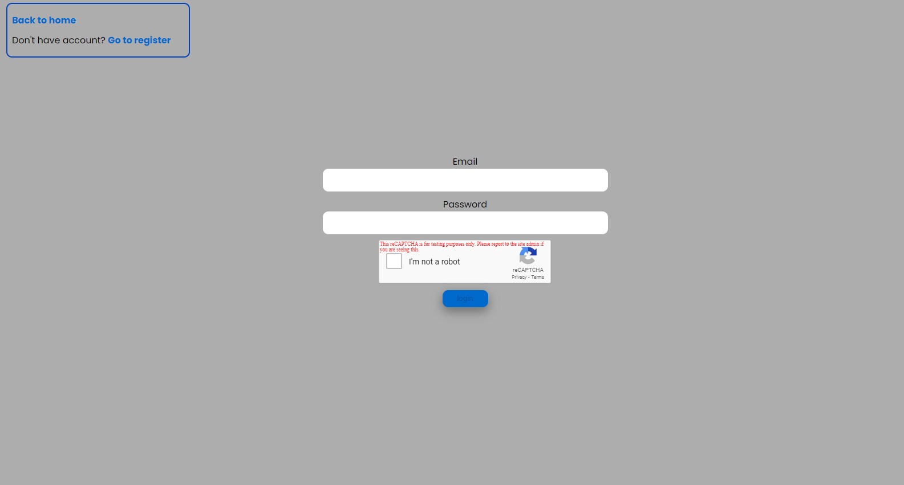

# notes-app

A simple application for creating and storing notes
consists of:
frontend (react, sass),
backend (express)
and mongodb base.
The application allows registration and login. After registration, it sends a thank you email. Access to the notes panel is available only to logged-in users. For protection against bots added captha.

## Technologies used

- [react ](react.png)
- [sass ](sass.png)
- [express ](express.png)
- [mongo DB ](mongo.png)

## Features

- User registration and login
- Thank-you email sent upon registration
- Notes panel only available to logged-in users
- CAPTCHA protection against bots
- Creating, editing, and deleting notes.

## Sampels

